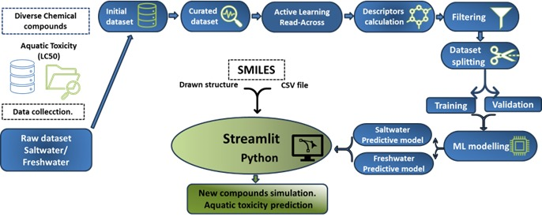

# Active Learning  Read-Across Models for Predicting the Aquatic Ecotoxicology Risk Assesment

Author: Gerardo M Casanola-Martin & Karel Dieguez-Santana

-------------------------------------------------------------------------------------------------

**A ML predictor for Rotifer species toxicity in Salt and Fresh Water**

The Rotifer ML predictor is a Web App that use MLR regression models to predict the salt and fresh water toxicity using a Rotifer species as a target. 

